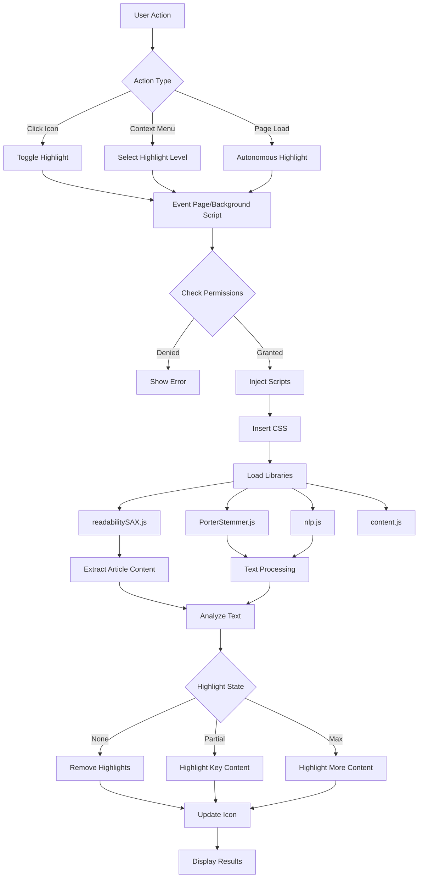
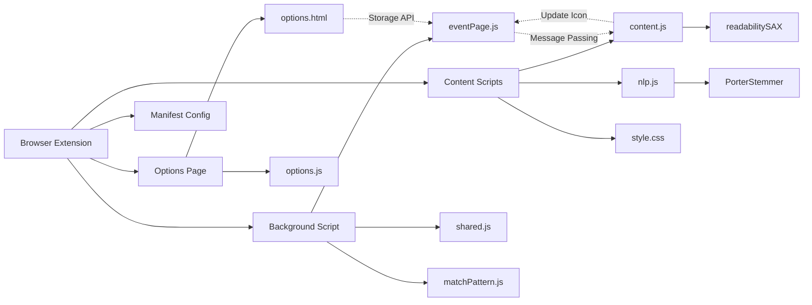
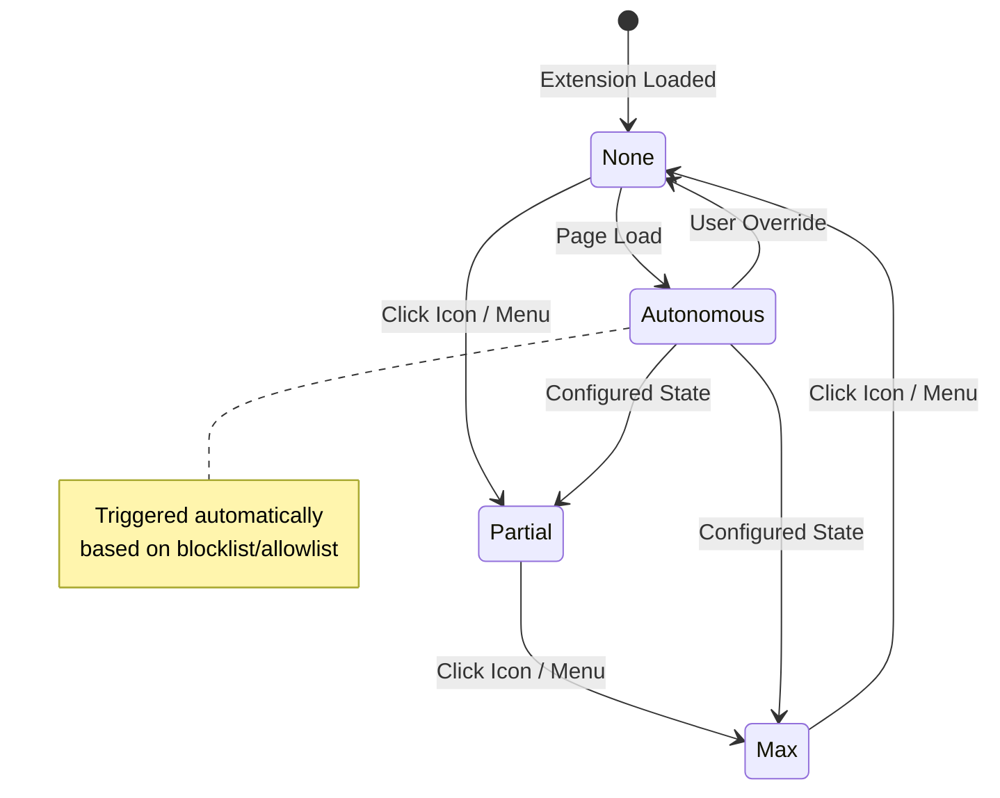
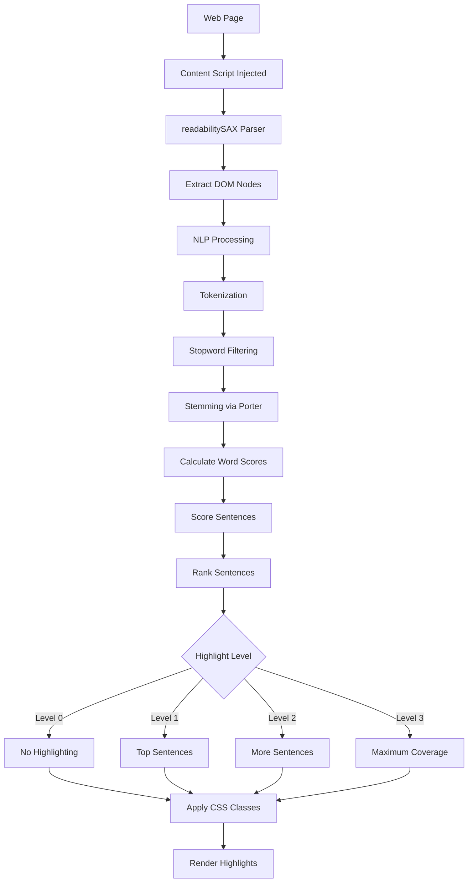

# Auto Highlight Extension Architecture

This document provides a visual overview of the Auto Highlight browser extension architecture using Mermaid diagrams.

## Extension Workflow

## Component Architecture

## State Management

## Data Flow

